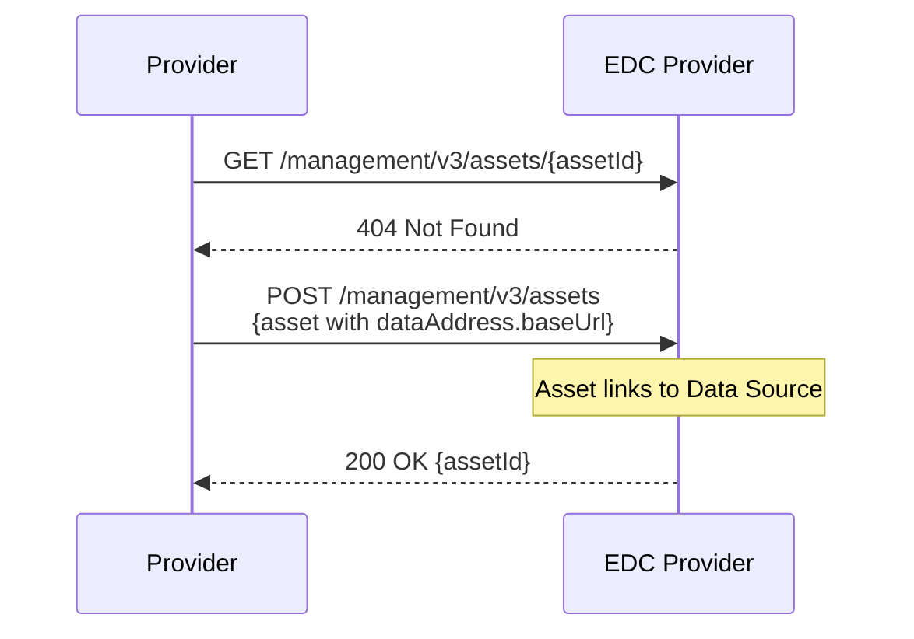
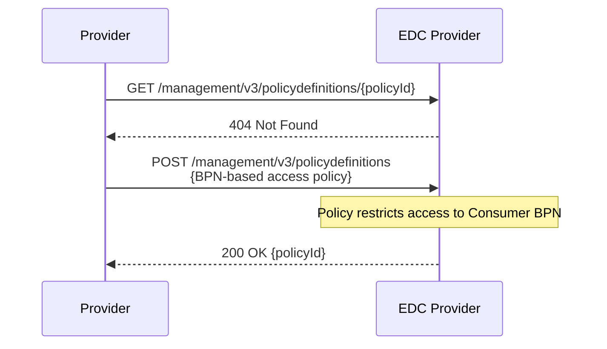
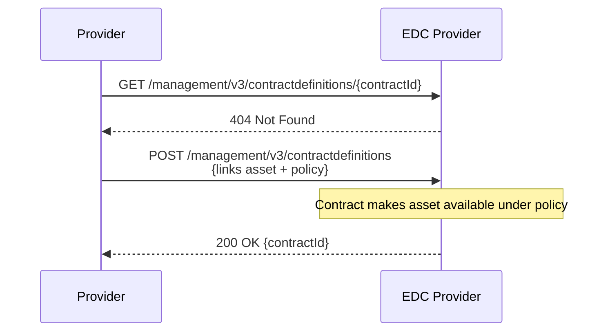
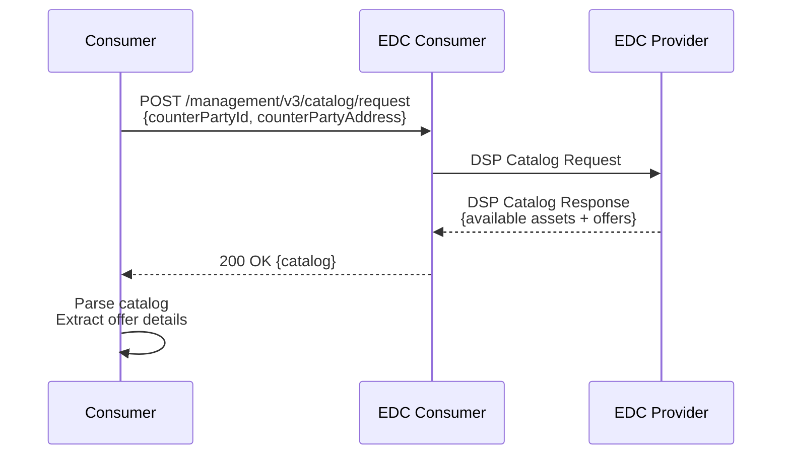
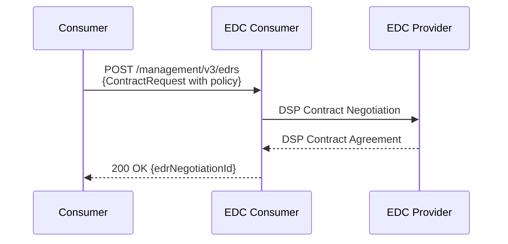
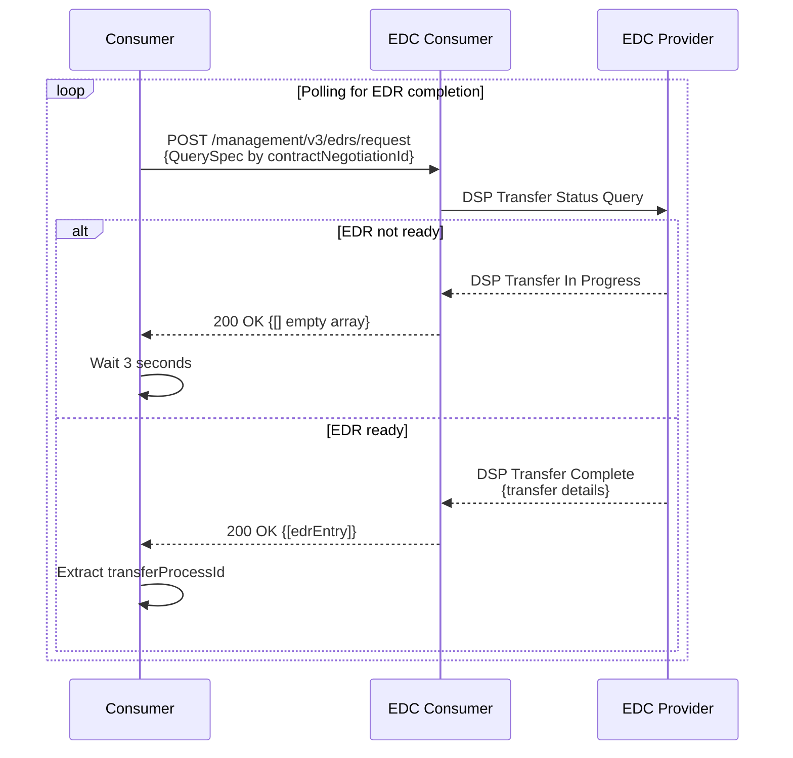
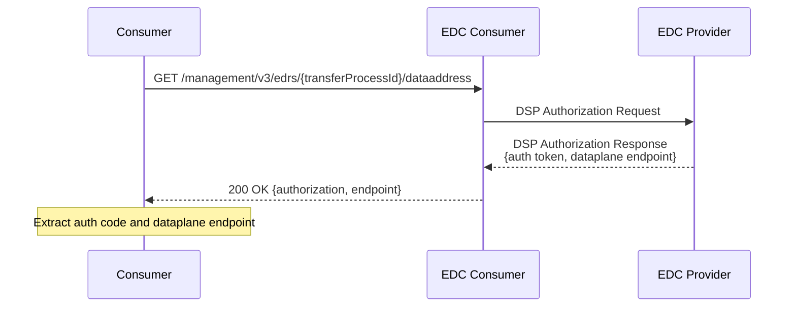
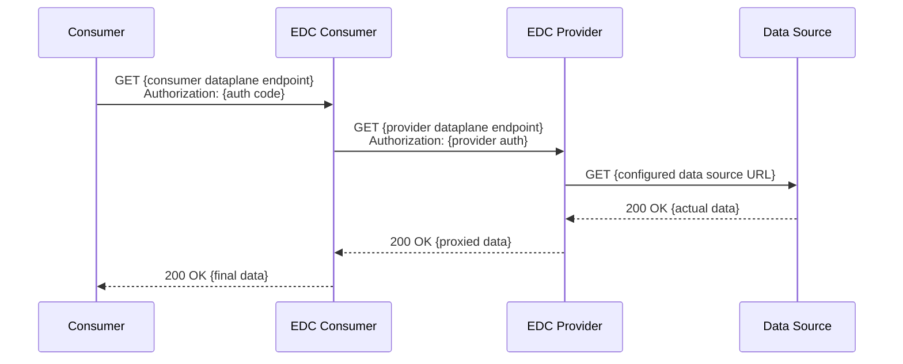

# Construct-X DSP Workflow Automation

This directory contains automation tools for the Eclipse Dataspace Connector (EDC) workflows in the Construct-X ecosystem.

## Files

- **`/scripts/dsp-workflow.sh`** - Complete automated DSP workflow script
- **`/scripts/.env`** - Environment configuration template
- **`/bruno`** - Bruno HTTP client collection for manual API testing

## DSP Workflow Script

The `dsp-workflow.sh` script automates the complete dataspace protocol workflow from provider setup to successful data retrieval.

### Features

- ✅ **Complete Automation**: End-to-end workflow from provider setup to data access
- ✅ **Resource Reuse**: Checks for existing resources and reuses them to avoid conflicts
- ✅ **Dynamic Parsing**: Extracts IDs, tokens, and endpoints from API responses
- ✅ **Error Handling**: Comprehensive error checking and user-friendly output
- ✅ **Health Checks**: Validates connector availability before starting
- ✅ **Configurable**: Uses environment variables for flexible configuration
- ✅ **Debug Mode**: Optional verbose output for troubleshooting
- ✅ **Clean Output**: Formatted JSON payloads for requests and responses
- ✅ **Flexible Data Sources**: Configurable data source URLs

### Workflow Steps

#### Provider Setup
1. **Asset Creation** - Creates data asset with configurable HTTP data address (reuses if exists)
2. **Policy Creation** - Creates BPN-based access policy (reuses if exists)
3. **Contract Definition** - Links asset and policy (reuses if exists)

#### Consumer Workflow
1. **Catalog Request** - Discovers available assets from provider
2. **EDR Initiation** - Starts contract negotiation for endpoint data reference
3. **EDR Monitoring** - Waits for negotiation completion
4. **Auth Code Extraction** - Gets authorization token from finalized EDR
5. **Data Access** - Retrieves actual data via dataplane

### Workflow Steps Sequence Diagrams

#### 1. Provider Setup - Asset Creation


#### 2. Provider Setup - Policy Creation


#### 3. Provider Setup - Contract Definition


#### 4. Consumer Workflow - Catalog Discovery


#### 5. Consumer Workflow - EDR Negotiation


#### 6. Consumer Workflow - EDR Status Monitoring


#### 7. Authorization Code Retrieval


#### 8. Data Access


### Setup

1. **Copy environment template**:
   ```bash
   cp env.example .env
   ```

2. **Configure your environment**:
   ```bash
   # Edit .env with your connector URLs and credentials
   nano .env
   ```

3. **Make script executable**:
   ```bash
   chmod +x dsp-workflow.sh
   ```

### Usage

```bash
# Run the complete DSP workflow (normal mode)
./dsp-workflow.sh

# Run with debug output
DEBUG=true ./dsp-workflow.sh

# Run with custom data source
DATA_SOURCE_URL="https://api.example.com/data" ./dsp-workflow.sh
```

### Environment Configuration

The script reads configuration from a `.env` file. Copy `env.example` to `.env` and adjust the values:

```bash
# Asset Configuration
ASSET_ID=asset-1

# Provider Configuration
PROVIDER_URL=https://dataprovider-x-controlplane.construct-x.prod-k8s.eecc.de
PROVIDER_BPN=BPNL00000000080L
PROVIDER_API_KEY=TEST2

# Consumer Configuration  
CONSUMER_URL=https://dataprovider-x-controlplane.construct-x.borrmann.dev
CONSUMER_BPN=BPNL00000000080L
CONSUMER_API_KEY=TEST2

# Optional Configuration
DATA_SOURCE_URL=https://api.example.com/data  # Default: JSONPlaceholder API
DEBUG=true                                    # Default: false
```

#### Configuration Variables

**Required Variables:**
- `ASSET_ID` - Unique identifier for the asset to create
- `PROVIDER_URL` - EDC provider controlplane URL
- `PROVIDER_BPN` - Business Partner Number of the provider
- `PROVIDER_API_KEY` - API key for provider authentication
- `CONSUMER_URL` - EDC consumer controlplane URL  
- `CONSUMER_BPN` - Business Partner Number of the consumer
- `CONSUMER_API_KEY` - API key for consumer authentication

**Optional Variables:**
- `DATA_SOURCE_URL` - URL of the data source for the asset (default: JSONPlaceholder API)
- `DEBUG` - Enable verbose debug output (default: false)

### Output Modes

#### Normal Mode (Clean Output)
- Shows workflow steps and status
- Displays formatted request and response payloads
- Clean, production-ready output

#### Debug Mode (Verbose Output)
- All normal mode output
- Additional debug messages
- Error response details
- Internal state information

### Example Output

```
=== Construct-X DSP Workflow Script ===
Asset ID: asset-1
Provider: https://dataprovider-x-controlplane.construct-x.prod-k8s.eecc.de
Consumer: https://dataprovider-x-controlplane.construct-x.borrmann.dev
Data Source: https://jsonplaceholder.typicode.com/todos

[STEP] Performing Health Checks
  → Checking Provider health
    ✓ Provider is healthy
  → Checking Consumer health
    ✓ Consumer is healthy
[SUCCESS] Health checks passed

=== PROVIDER SETUP ===
[STEP] Creating Policy Definition
  → Checking if policy asset-1-policy exists
    ✗ policy asset-1-policy does not exist
  → Creating policy definition
    ✓ HTTP 200
[SUCCESS] Policy asset-1-policy created successfully

[STEP] Creating Asset
  → Checking if asset asset-1 exists
    ✗ asset asset-1 does not exist
  → Creating asset
    ✓ HTTP 200
[SUCCESS] Asset asset-1 created successfully

[STEP] Creating Contract Definition
  → Checking if contract definition asset-1-contract exists
    ✗ contract definition asset-1-contract does not exist
  → Creating contract definition
    ✓ HTTP 200
[SUCCESS] Contract definition asset-1-contract created successfully

=== CONSUMER WORKFLOW ===
[STEP] Requesting Catalog from Provider
  → Requesting catalog
    ✓ HTTP 200
  → Parsing catalog response
    ✓ Offer ID: YXNzZXQtMS1jb250cmFjdA==:YXNzZXQtMQ==:...
    ✓ Permissions: [{"action":"use","constraint":{"and":[...]}}]
    ✓ Prohibitions: []
    ✓ Obligations: []
[SUCCESS] Catalog processed successfully

[STEP] Initiating EDR (Endpoint Data Reference)
  → Initiating EDR negotiation
    ✓ HTTP 200
    ✓ EDR Negotiation ID: 12345678-1234-1234-1234-123456789012
[SUCCESS] EDR negotiation initiated successfully

[STEP] Waiting for EDR to be cached
  → Waiting for EDR negotiation to complete (max 60s)
    ⏳ Attempt 1/20 - waiting 3s...
    EDR state: REQUESTED
    ⏳ Attempt 2/20 - waiting 3s...
    EDR state: FINALIZED
    ✓ EDR negotiation to complete is ready

[STEP] Querying Cached EDR
  → Querying cached EDR
    ✓ HTTP 200
[SUCCESS] EDR cached and ready

[STEP] Getting Authorization Code
  → Getting EDR data address
    ✓ HTTP 200
    ✓ Authorization Code: eyJhbGciOiJSUzI1NiI...
    ✓ Dataplane Endpoint: https://dataprovider-x-dataplane.construct-x.prod-k8s.eecc.de/api/public/...
[SUCCESS] Authorization code obtained successfully

[STEP] Accessing Data via Dataplane
  → Fetching data from dataplane
    ✓ HTTP 200

=== DATA SUCCESSFULLY RETRIEVED ===
Data from https://jsonplaceholder.typicode.com/todos:

[
  {
    "userId": 1,
    "id": 1,
    "title": "delectus aut autem",
    "completed": false
  },
  ...
]

[SUCCESS] DSP Workflow completed successfully!

🎉 DSP Workflow completed successfully! 🎉
```

### Error Handling

The script includes comprehensive error handling:

- **Environment Validation**: Checks all required variables are set
- **Health Checks**: Validates connector availability before starting
- **API Error Handling**: Proper HTTP status code checking with detailed error messages
- **Resource Conflicts**: Detects and reuses existing resources
- **Timeout Handling**: Waits for asynchronous operations with configurable timeouts

### Troubleshooting

#### Common Issues

1. **Environment Variables Missing**:
   ```
   Error: Required environment variable PROVIDER_URL is not set
   ```
   → Check your `.env` file configuration

2. **Health Check Failures**:
   ```
   [ERROR] Provider health check failed
   ```
   → Verify connector URLs and network connectivity

3. **API Authentication Errors**:
   ```
   HTTP 401 - Creating policy definition failed
   ```
   → Check API keys in `.env` file

4. **Resource Not Found in Catalog**:
   ```
   [ERROR] Asset asset-1 not found in catalog
   ```
   → Verify asset was created successfully on provider side

5. **EDR Negotiation Timeout**:
   ```
   [ERROR] EDR negotiation to complete not ready after 20 attempts
   ```
   → Check contract policies and BPN configuration

### Integration with Bruno Collection

This script complements the Bruno HTTP client collection in `tx-umbrella/`. Use Bruno for:
- **Manual Testing**: Step-by-step API exploration
- **Development**: Testing individual endpoints
- **Debugging**: Detailed request/response inspection

Use the script for:
- **Automation**: Complete workflow execution
- **CI/CD Integration**: Automated testing pipelines
- **Demonstration**: End-to-end dataspace protocol showcase

### Dependencies

- **bash** (4.0+)
- **curl** - HTTP client
- **jq** - JSON processing
- **Network access** to configured EDC endpoints

### Security Notes

- Store API keys securely in `.env` file
- Never commit `.env` file to version control
- Use appropriate API keys for each environment (dev/staging/prod)
- Validate SSL certificates in production environments
